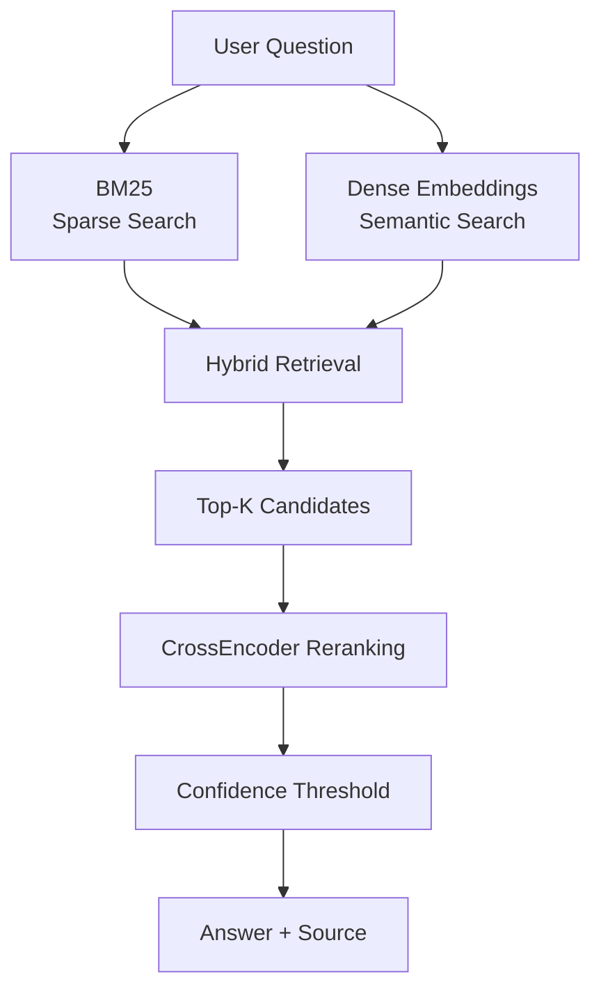

# Smart FAQ Hybrid Retrieval System

Smart FAQ Hybrid Retrieval System is an information-retrieval project that maps user questions to the most relevant FAQ answer using sparse retrieval, dense semantic retrieval, hybrid ranking, and neural reranking.

The system combines BM25 keyword retrieval with SentenceTransformer embeddings, reranks retrieved candidates with a CrossEncoder, applies a confidence threshold, and returns the selected FAQ answer together with its source category.

The current implementation focuses on the retrieval and reranking stages commonly used in RAG pipelines. It does not generate new answers with an external LLM.

## Retrieval Pipeline
 



## Features

- FAQ dataset loading and validation
- Text normalization and searchable FAQ preparation
- BM25 sparse retrieval
- SentenceTransformer dense embeddings
- Semantic retrieval
- Hybrid sparse + dense retrieval
- Configurable hybrid weighting with `alpha`
- Top-K candidate retrieval
- CrossEncoder neural reranking
- Confidence thresholding
- Grounded FAQ answer selection
- FAQ source/category tracking
- Recall@K evaluation
- Mean Reciprocal Rank (MRR) evaluation
- Interactive command-line interface
- BM25, semantic, and hybrid retrieval modes

## Repository Structure

```text
smart-faq-rag-search/
├── src/
│   └── smart_faq/
│       ├── __init__.py
│       ├── data.py
│       ├── retrieval.py
│       ├── evaluation.py
│       └── main.py
├── data/
│   └── sample_faqs.csv
├── examples/
│   └── sample_queries.json
├── tests/
├── README.md
├── requirements.txt
├── pyproject.toml
├── .gitignore
└── LICENSE
```

## Core Components

### Data Processing

`data.py` loads the FAQ dataset, validates required fields, checks for missing values and duplicate IDs, normalizes text, and converts each FAQ row into a searchable record.

Required CSV columns:

```text
id,question,answer,category
```

Each searchable FAQ record contains:

```text
id
question
answer
source
text
```

The `text` field combines the FAQ question and answer for retrieval.

### BM25 Sparse Retrieval

BM25 performs lexical retrieval based on query terms appearing in FAQ text.

```text
query → BM25 scoring → ranked candidates
```

### Dense Semantic Retrieval

SentenceTransformer converts user questions and FAQ text into embedding vectors.

This enables retrieval based on semantic similarity rather than exact keyword overlap alone.

Embedding model:

```text
all-MiniLM-L6-v2
```

### Hybrid Retrieval

Hybrid retrieval combines normalized BM25 and dense semantic scores.

```text
hybrid_score =
alpha × BM25_score
+
(1 - alpha) × dense_score
```

The default configuration uses:

```text
alpha = 0.5
```

### CrossEncoder Reranking

The retrieval stage first selects candidate FAQs.

A CrossEncoder then evaluates each query-candidate pair and reranks the candidates using a more precise relevance score.

Reranking model:

```text
cross-encoder/ms-marco-MiniLM-L-6-v2
```

```text
retrieve candidates
        ↓
CrossEncoder
        ↓
rerank
        ↓
best candidate
```

### Confidence Threshold

The highest-ranked result must pass a confidence threshold before its FAQ answer is returned.

If the score is below the threshold, the system returns:

```text
I do not have enough information.
```

This prevents unsupported matches from being returned as valid answers.

## Installation

Clone the repository:

```bash
git clone https://github.com/HadisArefanJazi/smart-faq-rag-search.git
cd smart-faq-rag-search
```

Install the required dependencies:

```bash
python -m pip install pandas numpy rank-bm25 sentence-transformers
```

Install the project in editable mode:

```bash
python -m pip install -e .
```

## Usage

Start the interactive FAQ search:

```bash
python -m smart_faq.main
```

Example:

```text
Ask a question. Type 'quit' to stop.

You: I forgot my password

Answer: You can reset your password by selecting Forgot Password on the login page and following the reset link sent to your email.
Source: account
```

Exit with:

```text
quit
```

## Retrieval Modes

Hybrid retrieval is the default:

```bash
python -m smart_faq.main
```

BM25 only:

```bash
python -m smart_faq.main --method bm25
```

Semantic retrieval only:

```bash
python -m smart_faq.main --method semantic
```

Hybrid retrieval explicitly:

```bash
python -m smart_faq.main --method hybrid
```

These modes allow direct comparison between lexical, semantic, and hybrid retrieval.

## Evaluation

Run retrieval evaluation with:

```bash
python -m smart_faq.main --evaluate
```

The project evaluates retrieval quality using two information-retrieval metrics.

### Recall@K

Recall@K measures whether the expected FAQ appears within the top `K` retrieved results.

```text
expected FAQ in top K     → 1
expected FAQ not in top K → 0
```

### Mean Reciprocal Rank

MRR measures how highly the expected FAQ is ranked.

```text
rank 1 → 1.00
rank 2 → 0.50
rank 3 → 0.33
```

Higher MRR indicates that relevant FAQs are consistently ranked closer to the top.

## Technology Stack

- Python
- NumPy
- pandas
- BM25
- rank-bm25
- Sentence Transformers
- Transformer embeddings
- CrossEncoder reranking
- Hugging Face models
- Git
- GitHub

## Project Scope

The current implementation covers:

- sparse retrieval
- dense semantic retrieval
- hybrid retrieval
- candidate ranking
- neural reranking
- confidence-based answer selection
- FAQ source/category tracking
- Recall@K and MRR evaluation
- interactive user input

The current implementation does not include:

- external LLM answer generation
- vector database indexing
- API serving
- production-scale document storage

The returned answer comes directly from the retrieved FAQ dataset rather than being generated by a language model.
